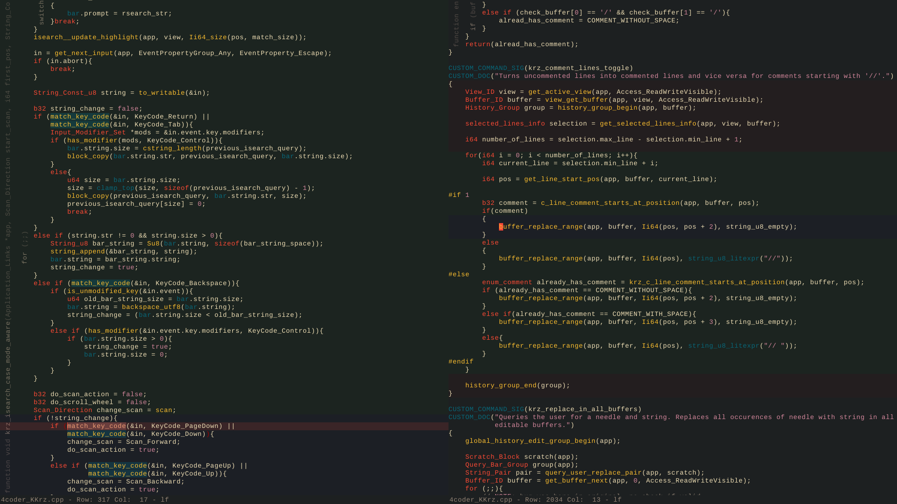

The code is very bad and unpolished, probably lots of bugs, but it works well for me, proceed with caution.

### How to build

1. Clone the repository and copy all the files into the 4Coder directory
2. Build by running the "build4coder.bat"
   
For release build use the command line:

```
build4coder.bat release
```


### Features: 

* Lots of features from VSCode ported 
* Vertical scope annotations https://4coder.handmade.network/wiki/7394-%5Bmodule%5D_vertical_scope_annotation
* Primitive syntax highlighting https://4coder.handmade.network/wiki/7370-%5Bmodule%5D_primitive_highlight
* Scope highlight https://4coder.handmade.network/wiki/7384-%5Bmodule%5D_scope_highlight
* Extensive support for selection based editing
* Highlight all substrings that are equal to the current selection
* Fullscreen split mode switch (F12)
* Gruvbox theme
* Still incomplete naysayer theme

